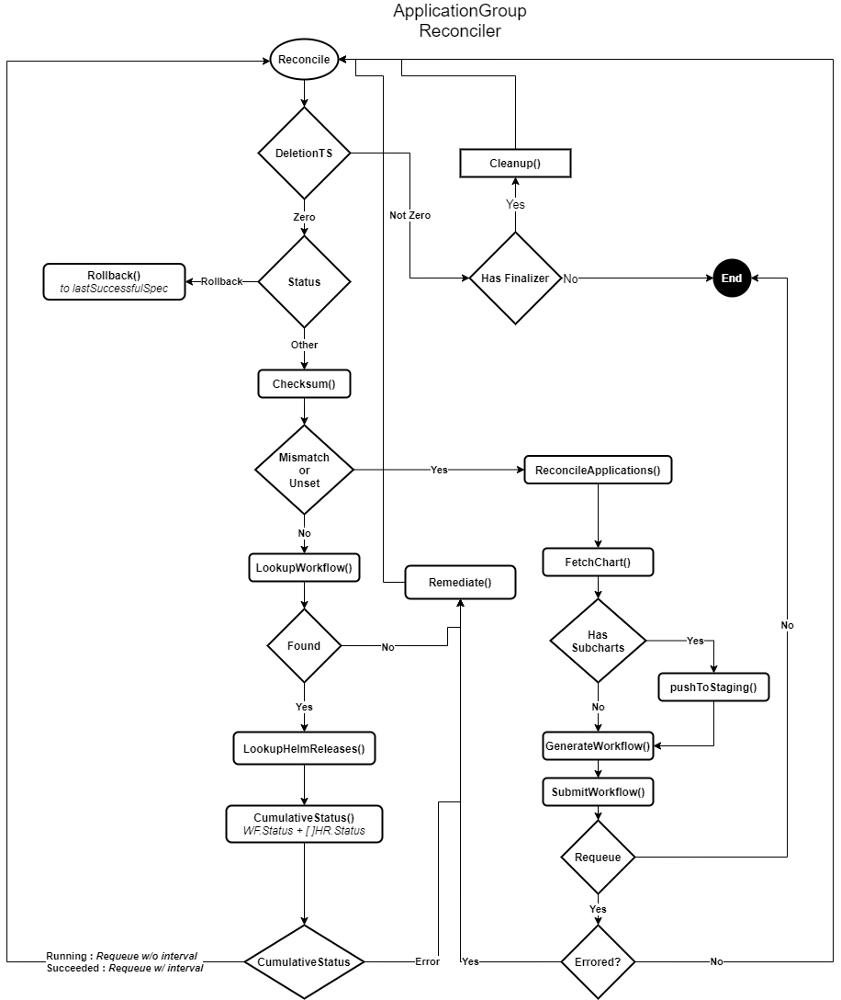

# Guide for contributors and developers

## Prerequisites

**Kubernetes Cluster** ([KinD](https://kind.sigs.k8s.io/)/Minikube/AKS/GKE/EKS/others) v1.20 or higher
**kubectl** - v1.18 or higher
**helm** - v3.5.2 or higher
**kubebuilder** - v2.3.1 or higher (Kubebuilder and controller-runtime binaries. Install using `make setup-kubebuilder` )
**controller-gen** - v0.5.0 or higher (Install using `make controller-gen`). This is needed to generate the ApplicationGroup CRDs. A `controller-gen`binary *> v0.5.0* will generate an incorrect CRD version

## Workspace Organization

| Package | Files | Description |
|---------|-------|-------------|
| | **Dockerfile** | Docker manifest to build and deploy the orkestra controller docker image
| | **main.go** | Entrypoint (`func main()`) to the controller. Bootstraps the orkestra controller manager and instantiates all supporting components needed by the reconciler.
| | **Tiltfile** | `Tilt` is a useful utility for development, that watches files for changes and builds & pushes new docker images to a live pod as and when changes occur. See [docs](https://docs.tilt.dev/) to learn more.
| **/** | **azure-pipelines.yml** | CI workflow manifest for Azure Pipelines
| **api/** | **v1alpha1/** | `ApplicationGroup` Custom Resource API definitions and structs.
| **chart/**| **orkestra/** | Helm chart for Orkestra controller, chartmuseum and argo workflow components.
| **config/** | **crd/** | Custom Resource Definition (CRDs) that must be registered with Kubernetes API Server. This is automatically generated by kubebuilder using `make manifest`.
| **controllers/** | **appgroup_controller.go** | Core controller logic for the `Reconcile()` function. See flow diagram below.
| | **appgroup_reconciler.go** | Logic to reconcile the state of the Application group object, by generating new workflows to get to the desired state. 
| | **suite_test.go** | Bootstrap function to run integration tests for the controller using Ginkgo's Behavior Driven Test framework.
| **pkg/** | **checksum.go** | `ApplicationGroup` spec checksum utilities
| | **configurer** | Configuration loader that parses the registry configuration config.yaml file.
| | **helm.go** | Wrappers for Helm Actions using the official helmv2 package.
| | **helpers.go** | Miscellaneous utility functions
| | **registry/** | Helm Registry functions using the office helmv2 package and chartmuseum for pull and push functionality, respectively
| | **workflow/** | DAG workflow generation and submission interface, implemented using Argo Workflows

## `Reconcile()`

<p align="center"></p>

## Build & Run

> Run the following `make` targets everytime the types are changed (`api/xxx_types.go`)

```terminal
make generate
/usr/local/bin/controller-gen object:headerFile="hack/boilerplate.go.txt" paths="./..."
```

```terminal
make manifests
/usr/local/bin/controller-gen "crd:trivialVersions=true" rbac:roleName=manager-role webhook paths="./..." output:crd:artifacts:config=config/crd/bases
```

### Manually

1. Build a docker image and push to your own personal docker registry (careful not to override the latest tag)

```terminal
docker build . -t <your-registry>/orkestra:<your-tag>
docker push <your-registry>/orkestra:<your-tag>
```

2. Update the orkestra deployment with your registry/image:tag

```terminal
helm upgrade orkestra chart/orkestra -n orkestra --create-namespace --set image.repository=<your-registry> --set image.tag=<your-tag>
```

### Using Tilt

Install the `tilt` binary using instructions provided at [installation](https://docs.tilt.dev/install.html)

```terminal
tilt up
Tilt started on http://localhost:10350/
v0.19.0, built 2021-03-19

(space) to open the browser
(s) to stream logs (--stream=true)
(t) to open legacy terminal mode (--legacy=true)
(ctrl-c) to exit
```

## Debugging in VSCode

### "Bridge to Kubernetes" extension

Install the ["Bridge to Kubernetes"](https://marketplace.visualstudio.com/items?itemName=mindaro.mindaro) and the official ["Kubernetes"](https://marketplace.visualstudio.com/items?itemName=ms-kubernetes-tools.vscode-kubernetes-tools) extensions from the VSCode Marketplace

- Deploy the orkestra controller using the deployment methods shown above - Manually or by using `Tilt`

Once the orkestra helm release has been successfully deployed you can start debugging using the following steps

