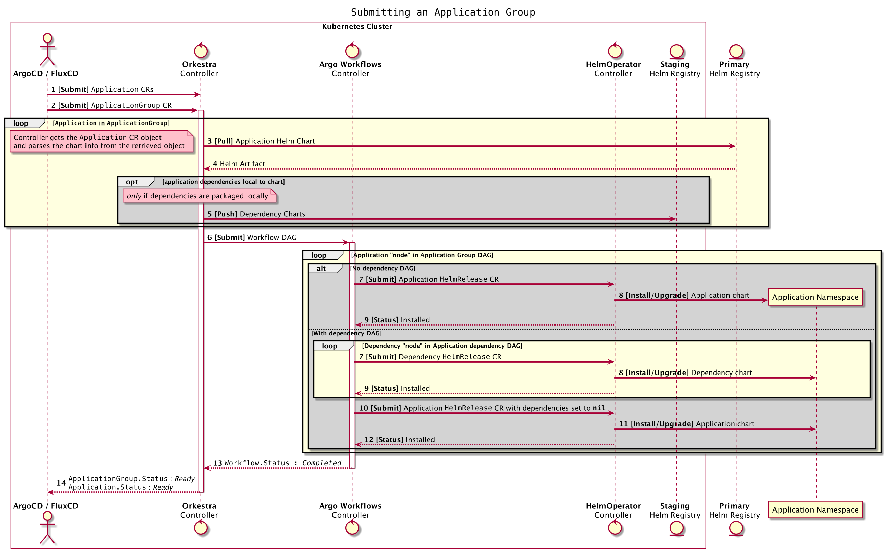
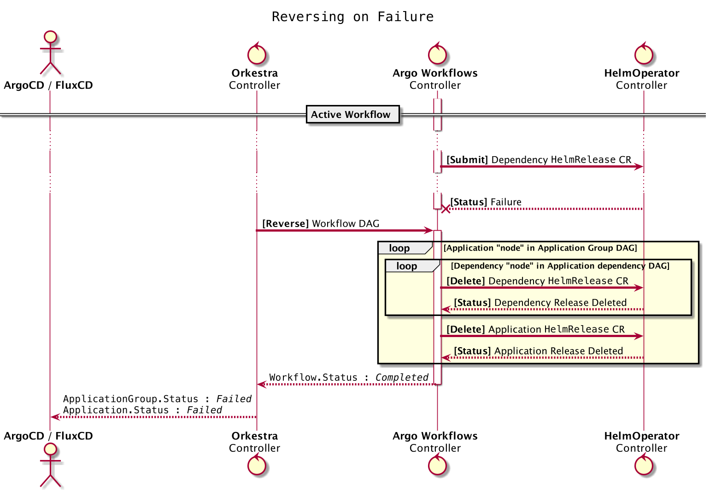

# Sequence Diagrams

## Submitting an Application Group to a Kubernetes Cluster

### Steps

**Step 1 & 2** : Apply the `ApplicationGroup` and `Application` custom resource objects to the Kubernetes cluster

*For each `Application` references in the `ApplicationGroup`*

**Step 3 & 4** : Download the Helm chart artifact (`tgz` file) from the helm registry with the information found in the `Application.Spec`.

**(conditional)** - *If `Application.Spec.Dependencies` is not `nil` i.e. dependent subcharts are embedded in the Application chart's `charts/` directory*

**Step 5** : Push all dependencies to the "Staging" registry.

**Step 6** : Generate and submit the Argo `Workflow` custom resource to the Kubernetes cluster. The `Workflow` resource defines the Application Dependency and Application Group DAGs.

*For each "application" node in the "application group" DAG*

**(conditional)** - *If "application" node has no dependencies DAG*

**Step 7, 8 & 9** - Submit the `HelmRelease` object referring to the "application" chart info via the Argo `executor` leaf node .

**(conditional)** - *Else "application" node has a dependencies DAG*

*For each dependency (subchart) in Application dependencies DAG*

**Step 7, 8, 9** - Submit the `HelmRelease` object referring to the "dependency" chart info via the Argo `executor` leaf node and wait for the `HelmRelease` `obj.Status` to be in a desirable state . Here the "dependency" chart could either be hosted outside the cluster by a public/private registry or be found in the "staging" registry (see Step 3 & 4 > conditional). 

**Step 10, 11, 12** -  Submit the `HelmRelease` object referring to the "application" chart info via the Argo `executor` leaf node. 

**Step 13 & 14** - Status of the submitted CRs is continuously monitored by the Orkestra and CD controller.

## Flow reversal on DAG node failure

