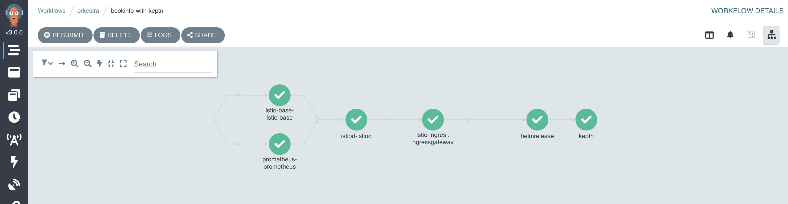

# Examples

## Prerequisites

- [kubectl](https://kubernetes.io/docs/tasks/tools/)
- [helm](https://helm.sh/docs/intro/install/)
- [Argo Workflow CLI](https://github.com/argoproj/argo-workflows/releases/tag/v3.0.0)
- [Keptn CLI](https://keptn.sh/docs/0.9.x/operate/install/)

## 1. [Bookinfo](https://github.com/Azure/orkestra/tree/main/examples/simple) without Quality Gates

In this example we deploy an application group consisting of two demo applications,

- Istio bookinfo app (with subcharts) : [source](https://istio.io/latest/docs/examples/bookinfo/)
- Ambassador : [source](https://www.getambassador.io/)

### Orkestra Helm Chart without Keptn

From the root directory of the repository, run:

```shell
helm upgrade --install orkestra chart/orkestra -n orkestra --create-namespace
```

Install the `ApplicationGroup`:

```terminal
kubectl apply -f examples/simple/bookinfo.yaml

applicationgroup.orkestra.azure.microsoft.com/bookinfo created
```

The orkestra controller logs should look as follows on success,

```shell
orkestra-885c5ff4-kh7n9 orkestra 2021-03-23T07:53:24.452Z       INFO    setup   starting manager
orkestra-885c5ff4-kh7n9 orkestra 2021-03-23T07:53:24.453Z       INFO    controller-runtime.manager      starting metrics server {"path": "/metrics"}
orkestra-885c5ff4-kh7n9 orkestra 2021-03-23T07:53:24.453Z       INFO    controller-runtime.controller   Starting EventSource    {"controller": "applicationgroup", "source": "kind source: /, Kind="}
orkestra-885c5ff4-kh7n9 orkestra 2021-03-23T07:53:24.554Z       INFO    controller-runtime.controller   Starting Controller     {"controller": "applicationgroup"}
orkestra-885c5ff4-kh7n9 orkestra 2021-03-23T07:53:24.554Z       INFO    controller-runtime.controller   Starting workers        {"controller": "applicationgroup", "worker count": 1}
... truncated for brevity ...
orkestra-885c5ff4-kh7n9 orkestra 2021-03-23T08:04:18.875Z       DEBUG   controllers.ApplicationGroup    workflow ran to completion and succeeded        {"appgroup": "bookinfo"}
orkestra-885c5ff4-kh7n9 orkestra 2021-03-23T08:04:18.901Z       DEBUG   controller-runtime.controller   Successfully Reconciled {"controller": "applicationgroup", "request": "/bookinfo"}
orkestra-885c5ff4-kh7n9 orkestra 2021-03-23T08:04:18.902Z       DEBUG   controller-runtime.manager.events       Normal  {"object": {"kind":"ApplicationGroup","name":"bookinfo","uid":"52c5095e-0aa1-4067-a434-f1155ebbbdcd","apiVersion":"orkestra.azure.microsoft.com/v1alpha1","resourceVersion":"30145"}, "reason": "ReconcileSuccess", "message": "Successfully reconciled ApplicationGroup bookinfo"}
```


### Verify that the Application helm release have been successfully deployed

```shell
helm ls

NAME            NAMESPACE       REVISION        UPDATED                                 STATUS    CHART            APP VERSION
orkestra        orkestra        1               2021-03-23 08:02:15.0044864 +0000 UTC   deployed  orkestra-0.1.0   0.1.0
ambassador      ambassador      1               2021-03-23 08:02:35.0044864 +0000 UTC   deployed  ambassador-6.6.0 1.12.1     
bookinfo        bookinfo        1               2021-03-23 08:04:08.6088786 +0000 UTC   deployed  bookinfo-v1      0.16.2     
details         bookinfo        1               2021-03-23 08:03:26.1043919 +0000 UTC   deployed  details-v1       1.16.2     
productpage     bookinfo        1               2021-03-23 08:03:47.4150589 +0000 UTC   deployed  productpage-v1   1.16.2     
ratings         bookinfo        1               2021-03-23 08:03:25.9770024 +0000 UTC   deployed  ratings-v1       1.16.2     
reviews         bookinfo        1               2021-03-23 08:03:36.9634599 +0000 UTC   deployed  reviews-v1       1.16.2     
```

### Send request to `productpage` via Ambassador gateway/proxy

```terminal
kubectl -n default exec curl -- curl -ksS https://ambassador.ambassador:443/bookinfo/ | grep -o "<title>.*</title>"
<title>Simple Bookstore App</title>
```

---

## 2. [Bookinfo](https://github.com/Azure/orkestra/tree/main/examples/keptn) with Quality Gates

### Prequisites

- A Kubernetes cluster with sufficient resources to run the Keptn Controller

> ⚠️ Avoid using a cluster with a low number of nodes and low CPU/RAM or a KinD, Minikube or microk8s cluster

In this example we will show how to use Keptn to perform a promotion based on the evaluation of a Quality Gate.

The Application Group deploys an application that relies on multiple supporting layers to be deployed and running before the application can be started. The *bookinfo* application relies on the following layers:

- *Istio CRDs* - This layer (*istio-base*) contains the Istio CRDs that are used to configure the Istio service mesh.
- *Prometheus* - This layer contains the Prometheus component that is used to monitor the application and leveraged by Keptn to perform the evaluation of the Quality Gate.
- *Istio* - This layer (*istiod) )contains the Istio service mesh that is used to deploy the application.
- *Istio Ingress Gateway* - This layer contains the Istio Ingress Gateway that is used to expose the application.
- *Bookinfo* - This layer contains the *bookinfo* application.

The scenarios that we will use in this example are:

The *bookinfo* application is deployed with the Istio sidecar injection enabled. The application is configured to use the Keptn executor to perform evaluation of the Quality Gate.



1. The *productpage* sidecar is configured to serve traffic without any issues.
We expect the `Workflow` and subsequently the `ApplicationGroup` to succeed.

#### Keptn dashboard - Success

> ⚠️ monitoring failed is a known, benign issue when submitting the `ApplicationGroup` multiple times.
Authenticate with Keptn Controller for the dashboard:

```shell
export KEPTN_ENDPOINT=http://$(kubectl get svc api-gateway-nginx -n orkestra -ojsonpath='{.status.loadBalancer.ingress[0].ip}')/api \
export KEPTN_ENDPOINT=http://$(kubectl get svc api-gateway-nginx -n orkestra -ojsonpath='{.status.loadBalancer.ingress[0].ip}')/api \
keptn auth --endpoint=$KEPTN_ENDPOINT --api-token=$KEPTN_API_TOKEN
```

Retrieve the dashboard URL, Username and Password:

> The IPs and password will differ for each cluster.

```shell
keptn configure bridge --output
Your Keptn Bridge is available under: http://20.75.119.32/bridge

These are your credentials
user: keptn
password: UxUqN6XvWMpsrLqp6BeL
```


2. The *productpage* sidecar is configured to inject faults (return status code 500, 80% of the time) using the [`VirtualService`](https://istio.io/latest/docs/tasks/traffic-management/fault-injection/). We expect the `Workflow` and subsequently the `ApplicationGroup` to fail & rollback to the previous `ApplicationGroup` spec (i.e. Scenario 1).

#### Keptn dashboard - Failure


### Installation

#### Orkestra Helm Chart

From the root directory of the repository, run:

```shell
helm upgrade --install orkestra chart/orkestra -n orkestra --create-namespace --set=keptn.enabled=true --set=keptn-addons.enabled=true
```

> 💡 Note: If prometheus is expected to run in a different namespace the user must specify the namespace in the `--set` option as follows,
>
> ```shell
> export PROM_NS=prometheus
> helm upgrade --install orkestra chart/orkestra -n orkestra --create-namespace --set=keptn.enabled=true --set=keptn-addons.enabled=true --set=keptn-addons.prometheus.namespace=$PROM_NS
> ```

### Scenario 1 : Successful Reconciliation

The *bookinfo* application is deployed using the following Kubernetes manifests:

The ConfigMap is used to configure the Keptn executor and contains the following:

- *keptn-config.yaml* - This file contains the Keptn configuration.
- *sli.yaml* - This file contains the SLI configuration.
- *slo.yaml* - This file contains the SLO configuration.
- *config.yaml* - This file contains the configuration for the `hey` load generator.

```shell
kubectl create -f examples/keptn/bookinfo.yaml -n orkestra \
kubectl create -f examples/keptn/bookinfo-keptn-cm.yaml -n orkestra
```

### Scenario 2 : Failed Reconciliation leading to Rollback

```shell
kubectl apply -f examples/keptn/bookinfo-with-faults.yaml -n orkestra
```

---

### Cleanup

1. Delete the *bookinfo* `ApplicationGroup` and wait for the reverse workflow to complete

```shell
kubectl delete -f examples/keptn/bookinfo.yaml -n orkestra
```

2. Once the `ApplicationGroup` is deleted, delete the Keptn configuration configMap

> ⚠️ Deleting the Keptn ConfigMap before the `ApplicationGroup` will cause the reverse `Workflow` to fail causing cleanup to fail.

```shell
kubectl delete -f examples/keptn/bookinfo-keptn-cm.yaml -n orkestra
```

---

### Manual Testing

#### Trigger evaluation

```terminal
keptn create project bookinfo --shipyard=./shipyard.yaml
keptn create service bookinfo --project=bookinfo
keptn configure monitoring prometheus --project=bookinfo --service=bookinfo
keptn add-resource --project=bookinfo --service=bookinfo --resource=slo.yaml --resourceUri=slo.yaml --stage=dev
keptn add-resource --project=bookinfo --service=bookinfo --resource=prometheus/sli.yaml  --resourceUri=prometheus/sli.yaml --stage=dev
keptn add-resource --project=bookinfo --service=bookinfo --resource=job/config.yaml  --resourceUri=job/config.yaml --stage=dev
keptn trigger evaluation --project=bookinfo --service=bookinfo --timeframe=5m --stage dev --start $(date -u +"%Y-%m-%dT%T")
```
