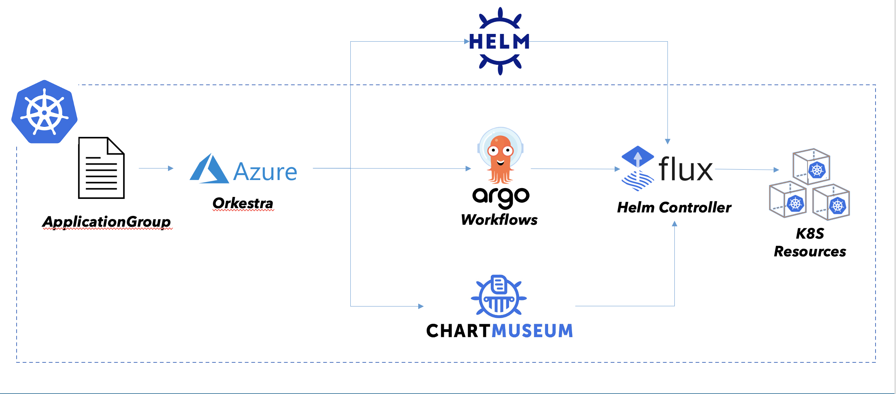

<iframe src="https://ghbtns.com/github-btn.html?user=Azure&repo=orkestra&type=star&count=true&size=large" frameborder="0" scrolling="0" width="170" height="30" title="GitHub"></iframe>

# Orkestra

[](https://pkg.go.dev/github.com/Azure/Orkestra)
[](https://github.com/Azure/orkestra/actions)
[](https://hub.docker.com/r/azureorkestra/orkestra)
[](https://codecov.io/gh/Azure/orkestra)

[](https://github.com/Azure/orkestra/graphs/contributors)

Orkestra is a cloud-native **Release Orchestration** and **Lifecycle Management (LCM)** platform for a related group of [Helm](https://helm.sh/) releases and their subcharts.

Orkestra is built on top of popular [CNCF](https://cncf.io/) tools and technologies like,

- [Argo Workflows](https://argoproj.github.io/workflows/),
- [Flux Helm Controller](https://github.com/fluxcd/helm-controller),
- [Chartmuseum](https://chartmuseum.com/)
- [Keptn](https://keptn.sh)

<p align="center"></p>

## Background and Motivation

### Dependency Management in Helm

While **Helm** can model dependencies using **subcharts**, this dependency relation at Helm release time is not very sophisticated. Moreover Helm does not support a way to specify a dependency relation between a parent chart and its subchart.

A Helm release for Helm is really a true atomic unit wherein in the Helm package dependency tree gets flattened by resource type and is not treated as a node in a dependency graph at all.

In the **ideal** world, pods and their replica sets are either perfectly **stateless** and don’t care about release state of other components to come up correctly. However, in the real world, there are many components that are not stateless and need to be aware of the state of other components to come up correctly.

Using **Helm Hooks**, **Kubernetes Jobs** and **Init Containers**, you might end up with a carefully crafted and working Helm release for a specific combination of components and conditions but it requires changes to the Helm release to be able to handle these dependencies.

To manage a group of Helm releases with a parent/subchart relationship or using a dependency relation, you need to use a dependency relation at Helm release time and not a dependency relation at Helm package time.

## What is Orkestra?

Orkestra is one solution to introduce Helm release orchestration. Orkestra provides this by building on top of **Argo Workflows**, a workflow engine on top of Kubernetes for workflow orchestration, where each step in a workflow is executed by a Pod. As such, Argo Workflow engine is a more powerful, more flexible adaptation of what **Init Containers** and **Kubernetes Jobs** provide without the orchestration.

Argo enables a DAG based dependency graph with defined workflow steps and conditions to transition through the graph, as well as detailed insight into the graph and its state. Helm releases matching transitions in the graph are executed by the FluxCD Helm controller operator. The FluxCD Helm controller operator is a Kubernetes operator that is responsible for executing Helm releases in a consistent manner.

### How it works

The unit of deployment for Orkestra based Helm releases is based on a workflow definition with a custom resource type that models the relationship between individual Helm releases making up the whole. The workflow definition is a **DAG** with defined workflow steps and conditions.

The `ApplicationGroup` spec allows to structure an orchestrated set of releases through grouping Helm releases into an group, either through defining a sequence on non-related charts and/or charts with subcharts, where subcharts are not merged into a single release but are executed as a release of their own inside a workflow step. The `ApplicationGroup` spec also allows to define a set of conditions that are evaluated at the beginning of the workflow and if any of the conditions fail, the whole workflow is aborted.

This gives you the ability to define a set of Helm releases that are orchestrated in a way that is easy to understand and to debug without having to modify the Helm release itself.

## Features 🌟

- **Dependency management** - DAG-based workflows for groups of application charts and their sub-charts using Argo Workflows
- **Fail fast during in-service upgrades** - limits the blast radius for failures during in-service upgrade of critical components to the immediate components that are impacted by the upgrade.
- **Failure Remediation** - rollback to last successful spec on encountering failures during in-service upgrades
- **Built for Kubernetes** - custom controller built using  [kubebuilder](https://github.com/kubernetes-sigs/kubebuilder)
- **Easy to use** - familiar declarative spec using Kubernetes [Custom Resource Definitions](https://kubernetes.io/docs/concepts/extend-kubernetes/api-extension/custom-resources/)
- **Works with any Continous Deployment system** - bring your own CD framework to deploy Orkestra Custom Resources. Works with any Kubernetes compatible Continuous Deployment framework like [FluxCD](https://fluxcd.io/) and [ArgoCD](https://argoproj.github.io/argo-cd/)
- **Built for GitOps** - describe your desired set of applications (and dependencies) declaratively and manage them from a version-controlled git repository

## Architecture 🏗

To learn more about how Orkestra works see the [architecture](./docs/architecture.md) docs

## Executors 🏃‍♂️

### Helmrelease Executor

The default executor is responsible for deploying the HelmRelease object passed in as an input parameter to the docker container. The HelmRelease is represented by a base64 encoded YAML string. The executor deploys, watches and polls for the status of the deployed HelmRelease until it either succeeds/fails or it times out.

Source code for the HelmRelease executor is available [here](https://github.com/Azure/helmrelease-workflow-executor)

### Keptn Executor (Work in progress)

The Keptn executor is an evaluation executor responsible for running tests on the deployed helm release using the Keptn API and Keptn evaluations engine. The Keptn executor is a custom executor that is chained to the default HelmRelease executor. This allows each release to be evaluated against a set of SLOs/SLIs before it is deployed/updated.

Source code for the Keptn executor is available [here](https://github.com/Azure/keptn-workflow-executor)


## Use Cases 💼

### 5G Network Functions 📱

Network functions are not always operated, deployed, and managed in isolation of each other. Network functions implementing parts of a 3GPP release based 5G core often operate in conjunction with other network functions implementing other parts. For example, the deployment of a single Session Management Function might depend on foundational PaaS services, like a Service Mesh, Open Policy Agent (OPA), Cert Manager, etc being in place and functioning.


## Installation 🧰

To get started you need the following:

- A Kubernetes cluster (AKS, GKE, EKS, Kind, Minikube, etc)
- [`kubectl`](https://kubernetes.io/docs/tasks/tools/)
- [`helm`](https://helm.sh/docs/intro/install/)
- [`argo`](https://github.com/argoproj/argo/releases)

### Using Helm

```shell
helm upgrade --install orkestra chart/orkestra/ --namespace orkestra --create-namespace
```

### Argo Workflow Dashboard

```shell
argo server
```

and then open the dashboard at [`http://localhost:2746`](http://localhost:2746)

## Developers 👩‍💻

Follow the development [guide](./docs/developers.md) to get started with building and debugging Orkestra

## Community 🧑‍🤝‍🧑

Connect with the Azure Orkestra community:

- GitHub [issues](https://github.com/Azure/orkestra/issues) and [pull requests](https://github.com/Azure/orkestra/pulls) in this repo
- Azure Orkestra Slack: Join the Azure Orkestra [Slack](https://join.slack.com/t/azureorkestra/shared_invite/zt-rowzrite-Hm_eaih4GyjjZXWftuoqPQ)

## Contributing 🎁

For instructions about setting up your environment to develop and extend the operator, please see
[contributing.md](https://github.com/Azure/Orkestra/blob/main/CONTRIBUTING.md)

This project welcomes contributions and suggestions.  Most contributions require you to agree to a
Contributor License Agreement (CLA) declaring that you have the right to, and do, grant us
the rights to use your contribution. For details, visit https://cla.microsoft.com.

When you submit a pull request, a CLA-bot will automatically determine whether you need to provide
a CLA and decorate the PR appropriately (e.g., label, comment). Simply follow the instructions
provided by the bot. You will only need to do this once across all repos using our CLA.

This project has adopted the [Microsoft Open Source Code of Conduct](https://opensource.microsoft.com/codeofconduct/).
For more information see the [Code of Conduct FAQ](https://opensource.microsoft.com/codeofconduct/faq/) or
contact [opencode@microsoft.com](mailto:opencode@microsoft.com) with any additional questions or comments.

### Reporting security issues and security bugs

For instructions on reporting security issues and bugs, please see [security.md](https://github.com/Azure/Orkestra/blob/main/SECURITY.md)
