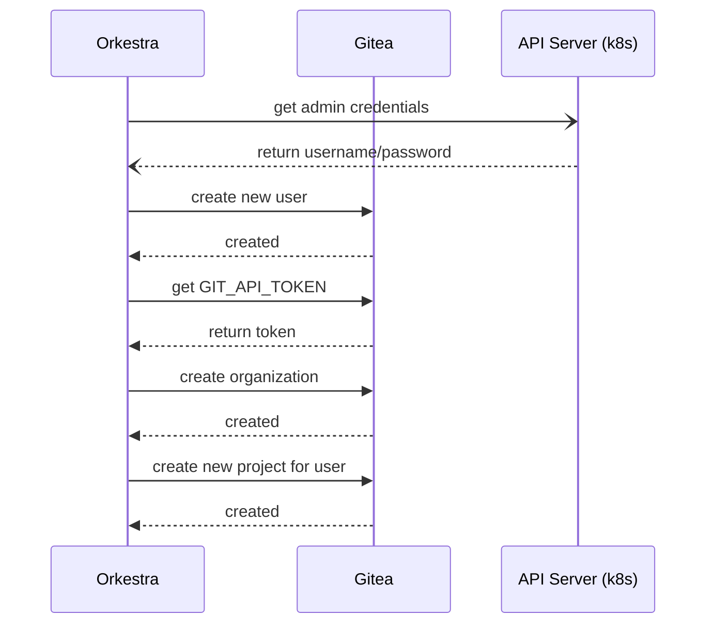
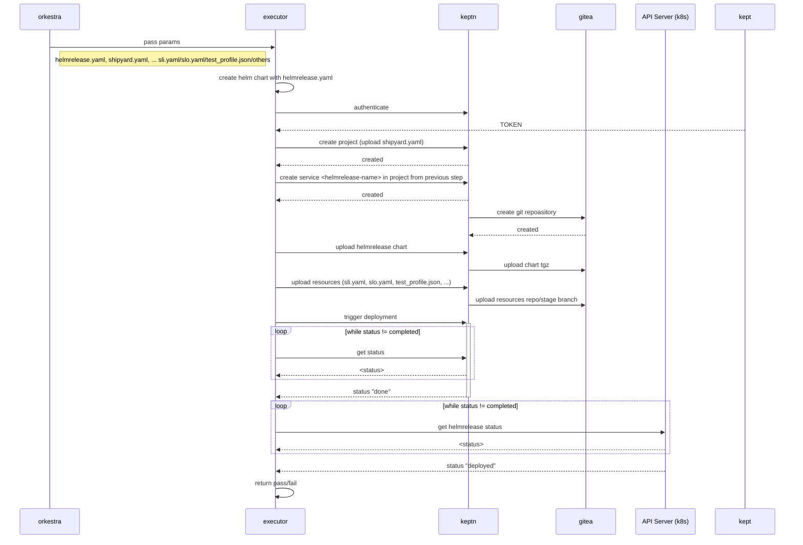

# Design

<p align="center"></p>

## ApplicationGroup Plugin Spec - Configuration Data (opaque blob)

```yaml
apiVersion: orkestra.azure.microsoft.com/v1alpha1
kind: ApplicationGroup
metadata:
  name: bookinfo 
spec:
  interval: 1m
  applications:
    - name: ambassador
      dependencies: []
      spec:
        chart:
          url: "https://www.getambassador.io/helm"
          name: ambassador 
          version: 6.6.0
        release:
          targetNamespace: ambassador 
          values:
            service:
              type: ClusterIP
      plugin:
      - name: quality-gates
        type: keptn
        configMapRef: 
          name: keptn-config
          namespace: keptn 
---
apiVersion: v1
kind: ConfigMap
metadata:
  name: keptn-config
  namespace: keptn
data:
  shipyard.yaml: |
    apiVersion: "spec.keptn.sh/0.2.0"
    kind: "Shipyard"
    metadata:
      name: "shipyard"
    spec:
      stages:
        - name: "dev"
          sequences:
            - name: "delivery"
              tasks:
                - name: "deployment"
                  properties:
                    # "direct" -> helm service 
                    deploymentstrategy: "direct"
                - name: "release"
        - name: "production"
          sequences:
            - name: "delivery"
              triggeredOn:
                - event: "dev.delivery.finished"
              tasks: 
              - name: "deployment"
                deploymentstrategy: "direct"
              - name: "release"
  slo.yaml: |
    stage: dev
    data:
      spec_version: '0.1.0'
      comparison:
        compare_with: "single_result"
        include_result_with_score: "pass"
        aggregate_function: avg
      objectives:
        - sli: http_response_time_seconds_main_page_sum
          pass:
            - criteria:
                - "<=1"
          warning:
            - criteria:
                - "<=0.5"
        - sli: request_throughput
          pass:
            - criteria:
                - "<=+100%"
                - ">=-80%"
        - sli: go_routines
          pass:
            - criteria:
                - "<=100"
      total_score:
        pass: "90%"
        warning: "75%"
  sli.yaml: |
    stage: dev
    data:
      spec_version: '1.0'
      indicators:
        http_response_time_seconds_main_page_sum: sum(rate(http_server_request_duration_seconds_sum{method="GET",route="/",status_code="200",job="$SERVICE-$PROJECT-$STAGE-canary"}[$DURATION_SECONDS])/rate(http_server_request_duration_seconds_count{method="GET",route="/",status_code="200",job="$SERVICE-$PROJECT-$STAGE-canary"}[$DURATION_SECONDS]))
        http_requests_total_sucess: http_requests_total{status="success"}
        go_routines: go_goroutines{job="$SERVICE-$PROJECT-$STAGE"}
        request_throughput: sum(rate(http_requests_total{status="success"}[$DURATION_SECONDS]))
```

## Initialize

### Setup Gitea for keptn

#### Sequence Diagram



> This sequence is run only once to initialize Keptn plugin
>
> When and how to run this step is TBD

- Gitea is setup with an Admin account with the credentials loaded into the gitea-0 pod/statefulset ENV variables. The init runner should fetch these credentials in order to setup a new user for Keptn

  > alternative: configure and pass admin credentials through helm values and make them available to orkestra at helm install/upgrade time

- Create a new user named "azureorkestra" and get the API_TOKEN

`POST http://<gitea-service>:<gitea-port>/api/v1/admin/users/`

```json
{
  "email": "orkestra@azure.com",
  "full_name": "azureorkestra",
  "login_name": "azureorkestra",
  "password": "password",
  "username": "keptn",
  "must_change_password": false
}
```

> with basic auth for user azureorkestra

`POST http://<gitea-service>:<gitea-port>/api/v1/users/azureorkestra/tokens`

```json
{
  "name": "keptn-controller"`
}

Response - save the sha1 since it will not be provided in the GET call
{
  "id": 1,
  "name": "keptn-controller",
  "sha1": "0dce23c13e0ed69a0f5466fe34a65039477e4d1f",
  "token_last_eight": "477e4d1f"
}
```

- Create a new organization (???) using keptn

> with basic auth for user azureorkestra

`POST http://<gitea-service>:<gitea-port>/api/v1/orgs`

```json
{
  "username": "keptn"
}
```

> For all keptn comms use git repository address `http://<gitea-service>:<gitea-port>/keptn/<application-name>.git`

```env
GIT_USER=azureorkestra
GIT_TOKEN=0dce23c13e0ed69a0f5466fe34a65039477e4d1f
GIT_REMOTE_URL=http://gitea-http.default.svc.cluster.local:3000/keptn/<application-name>.git 
```

## Executor Workflow



> Parameters are passed as input args to the executor along with the helmrelease and type of operator

Args:

- `GIT_USER=azureorkestra`
- `GIT_TOKEN=0dce23c13e0ed69a0f5466fe34a65039477e4d1f`
- `GIT_REMOTE_URL=http://gitea-http.default.svc.cluster.local:3000/keptn/<helmrelease-name>.git`

- plugin configuration data blob (`plugin.[].data`)
- package the incoming application `helmrelease` as a Helm Chart (tgz) and store in the local filesystem
- authenticate with the keptn controlplane and retrieve the TOKEN for future requests
- create a new keptn project using the incoming `helmrelease.metadata.name` using `shipyard.yaml` read from the plugin configuration configmap.

> keptn inturn creates a git repository for the project in Gitea

- create a new keptn service with the `helmrelease-name` in project `helmrelease.metadata.name`

- add the newly packaged `helmrelease` helm chart as a resource to `resourceUri=helm/<helmrelease-name>.tgz` to `all-stages`

> each stage has it's own git branch which is created by keptn using the shipyard.yaml stages field

- add all other files (sli.yaml, slo.yaml, test.json, ...) as resources to the relevant stages.

- trigger keptn deployment

- start status loop(s)
-- check keptn status
-- check helmrelease status

- return
