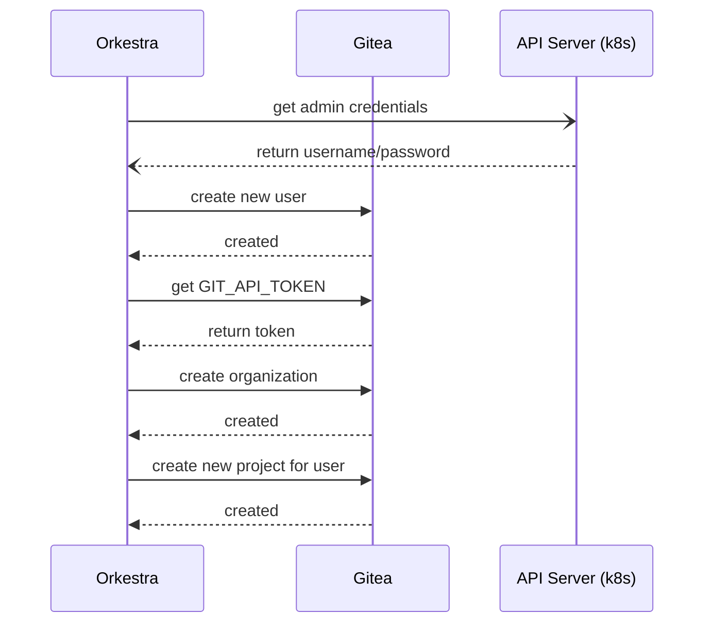
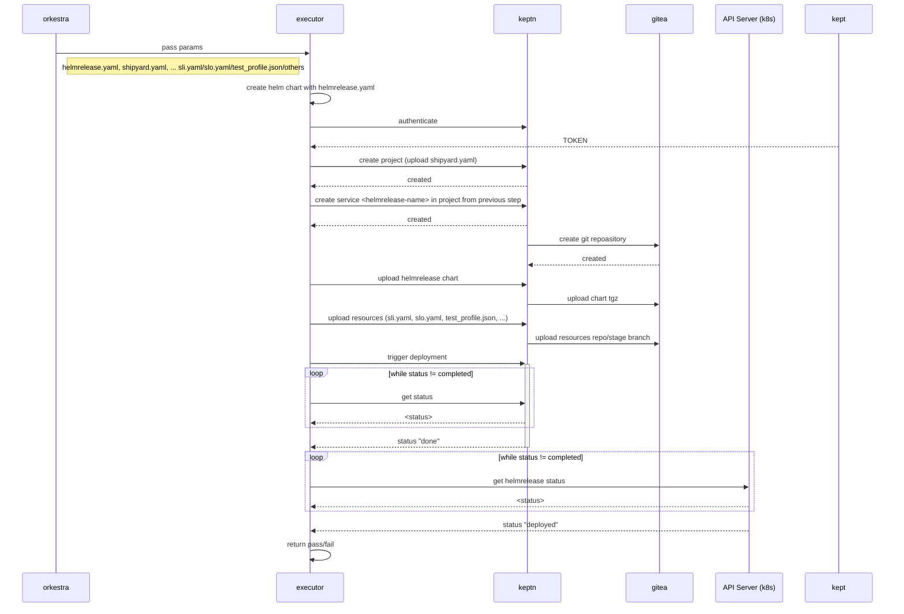

```mermaid
sequenceDiagram
    participant orkestra as Orkestra
    participant gitea as Gitea
    participant k8s as API Server (k8s)

    orkestra-)k8s: get admin credentials
    k8s--)orkestra: return username/password
    orkestra->>gitea: create new user
    gitea-->>orkestra: created
    orkestra->>gitea: get GIT_API_TOKEN
    gitea-->>orkestra: return token
    %% not sure if we need to create an org
    orkestra->>gitea: create organization
    gitea-->>orkestra: created
    orkestra->>gitea: create new project for user
    gitea-->>orkestra: created
```

```mermaid
sequenceDiagram
  participant orkestra
  participant executor
  participant keptn
  participant gitea
  participant k8s as API Server (k8s)

  orkestra->>executor: pass params
  note right of orkestra: helmrelease.yaml, shipyard.yaml, ... sli.yaml/slo.yaml/test_profile.json/others

  executor->>executor: create helm chart with helmrelease.yaml

  executor->>keptn: authenticate
  kept-->>executor: TOKEN
  %% with Token
  executor->>keptn: create project (upload shipyard.yaml)
  keptn-->>executor: created
  executor->>keptn: create service <helmrelease-name> in project from previous step
  keptn-->>executor: created
  keptn->>gitea: create git repoasitory
  gitea-->>keptn: created
  executor->>keptn: upload helmrelease chart
  keptn->>gitea: upload chart tgz
  executor->>keptn: upload resources (sli.yaml, slo.yaml, test_profile.json, ...)
  keptn->>gitea: upload resources repo/stage branch
  executor->>+keptn: trigger deployment
  loop while status != completed
    executor->>keptn: get status
    keptn-->>executor: <status>
  end
  keptn-->>-executor: status "done"
  
  loop while status != completed
    executor->>k8s: get helmrelease status
    k8s-->>executor: <status>
  end
  k8s-->>executor: status "deployed"

  executor->>executor: return pass/fail
```