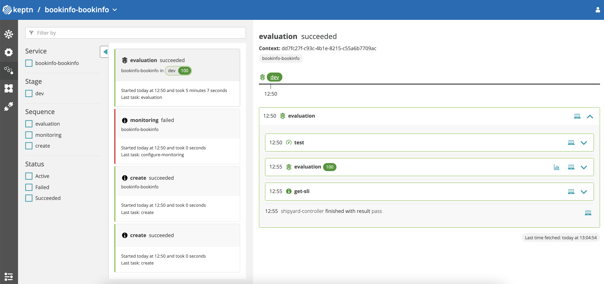
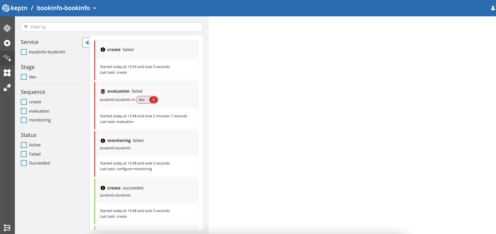

# Evaluation & Quality Gate based promotions using Keptn

## Prequisites

- A Kubernetes cluster with sufficient resources to run the Keptn Controller

> ⚠️ Avoid using a cluster with a low number of nodes and low CPU/RAM or a KinD, Minikube or microk8s cluster

## Description

In this example we will show how to use Keptn to perform a promotion based on the evaluation of a Quality Gate.

The Application Group deploys an application that relies on multiple supporting layers to be deployed and running before the application can be started. The *bookinfo* application relies on the following layers:

- *Istio CRDs* - This layer (*istio-base*) contains the Istio CRDs that are used to configure the Istio service mesh.
- *Prometheus* - This layer contains the Prometheus component that is used to monitor the application and leveraged by Keptn to perform the evaluation of the Quality Gate.
- *Istio* - This layer (*istiod) )contains the Istio service mesh that is used to deploy the application.
- *Istio Ingress Gateway* - This layer contains the Istio Ingress Gateway that is used to expose the application.
- *Bookinfo* - This layer contains the *bookinfo* application.

The scenarios that we will use in this example are:

The *bookinfo* application is deployed with the Istio sidecar injection enabled. The application is configured to use the Keptn executor to perform evaluation of the Quality Gate.


1. The *productpage* sidecar is configured to serve traffic without any issues.
We expect the `Workflow` and subsequently the `ApplicationGroup` to succeed.

### Keptn dashboard - Success

> ⚠️ monitoring failed is a known, benign issue when submitting the `ApplicationGroup` multiple times.



2. The *productpage* sidecar is configured to inject faults (return status code 500, 80% of the time) using the [`VirtualService`](https://istio.io/latest/docs/tasks/traffic-management/fault-injection/). We expect the `Workflow` and subsequently the `ApplicationGroup` to fail & rollback to the previous `ApplicationGroup` spec (i.e. Scenario 1).

### Keptn dashboard - Failure



## Installation

### Orkestra Helm Chart

From the root directory of the repository, run:

```shell
helm upgrade --install orkestra chart/orkestra -n orkestra --create-namespace --set=keptn.enabled=true --set=keptn-addons.enabled=true
```

> 💡 Note: If prometheus is expected to run in a different namespace the user must specify the namespace in the `--set` option as follows,
>
> ```shell
> export PROM_NS=prometheus
> helm upgrade --install orkestra chart/orkestra -n orkestra --create-namespace --set=keptn.enabled=true --set=keptn-addons.enabled=true --set=keptn-addons.prometheus.namespace=$PROM_NS
> ```

### Scenario 1 : Successful Reconciliation

The *bookinfo* application is deployed using the following Kubernetes manifests:

The ConfigMap is used to configure the Keptn executor and contains the following:

- *keptn-config.yaml* - This file contains the Keptn configuration.
- *sli.yaml* - This file contains the SLI configuration.
- *slo.yaml* - This file contains the SLO configuration.
- *config.yaml* - This file contains the configuration for the `hey` load generator.

```shell
kubectl create -f examples/keptn/bookinfo.yaml -n orkestra \
kubectl create -f examples/keptn/bookinfo-keptn-cm.yaml -n orkestra
```

### Scenario 2 : Failed Reconciliation leading to Rollback

```shell
kubectl apply -f examples/keptn/bookinfo-with-faults.yaml -n orkestra
```

## Cleanup

1. Delete the *bookinfo* `ApplicationGroup` and wait for the reverse workflow to complete

```shell
kubectl delete -f examples/keptn/bookinfo.yaml -n orkestra
```

2. Once the `ApplicationGroup` is deleted, delete the Keptn configuration configMap

> ⚠️ Deleting the Keptn ConfigMap before the `ApplicationGroup` will cause the reverse `Workflow` to fail causing cleanup to fail.

```shell
kubectl delete -f examples/keptn/bookinfo-keptn-cm.yaml -n orkestra
```

<!-- ## Manual Testing

### Authenticate with keptn

```terminal
export KEPTN_API_TOKEN=$(kubectl get secret keptn-api-token -n orkestra -ojsonpath='{.data.keptn-api-token}' | base64 --decode)
export KEPTN_ENDPOINT=http://$(kubectl get svc api-gateway-nginx -n orkestra -ojsonpath='{.status.loadBalancer.ingress[0].ip}')/api
```

```terminal
keptn auth --endpoint=$KEPTN_ENDPOINT --api-token=$KEPTN_API_TOKEN

Starting to authenticate
Successfully authenticated against the Keptn cluster http://20.72.120.233/api
```

### Retrieve username and password for Keptn bridge (dashboard)

```terminal
keptn configure bridge --output
```

### Trigger evaluation

```terminal
keptn create project hey --shipyard=./shipyard.yaml
keptn create service bookinfo --project=hey
keptn configure monitoring prometheus --project=hey --service=bookinfo
keptn add-resource --project=hey --service=bookinfo --resource=slo.yaml --resourceUri=slo.yaml --stage=dev
keptn add-resource --project=hey --service=bookinfo --resource=prometheus/sli.yaml  --resourceUri=prometheus/sli.yaml --stage=dev
keptn add-resource --project=hey --service=bookinfo --resource=job/config.yaml  --resourceUri=job/config.yaml --stage=dev
keptn trigger evaluation --project=hey --service=bookinfo --timeframe=5m --stage dev --start $(date -u +"%Y-%m-%dT%T")
``` -->
