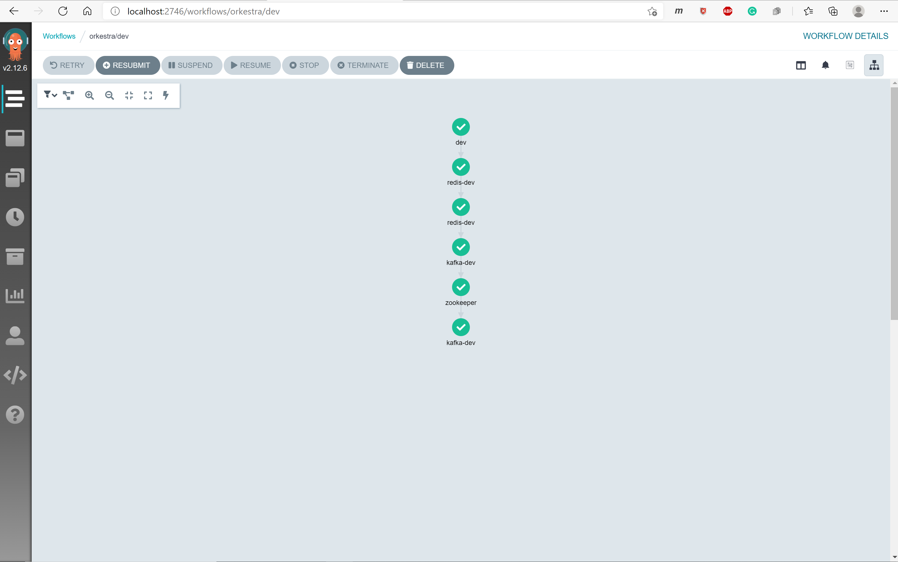

# Instructions

In this example we deploy an application group consisting of two demo applications,
- kafka (and it's dependent chart - zookeeper)
- redis

## Prerequisites

- `kubectl`

Install the `ApplicationGroup`: 

```console
kubectl apply -f examples/simple

applicationgroup.orkestra.azure.microsoft.com/dev created
```

The orkestra controller logs should look as follows on success,

```log
orkestra-6967b4676b-h94dl orkestra 2021-03-03T19:45:15.655Z     INFO    controller-runtime.metrics      metrics server is starting to listen    {"addr": ":8080"}
orkestra-6967b4676b-h94dl orkestra 2021-03-03T19:45:19.360Z     INFO    setup   starting manager
orkestra-6967b4676b-h94dl orkestra 2021-03-03T19:45:19.360Z     INFO    controller-runtime.manager      starting metrics server {"path": "/metrics"}
orkestra-6967b4676b-h94dl orkestra 2021-03-03T19:45:19.360Z     INFO    controller-runtime.controller   Starting EventSource    {"controller": "applicationgroup", "source": "kind source: /, Kind="}
orkestra-6967b4676b-h94dl orkestra 2021-03-03T19:45:19.461Z     INFO    controller-runtime.controller   Starting Controller     {"controller": "applicationgroup"}
orkestra-6967b4676b-h94dl orkestra 2021-03-03T19:45:19.461Z     INFO    controller-runtime.controller   Starting workers        {"controller": "applicationgroup", "worker count": 1}
orkestra-6967b4676b-h94dl orkestra 2021-03-03T19:45:28.347Z     DEBUG   controllers.ApplicationGroup    workflow in pending/running state. requeue and reconcile after a short period {"appgroup": "dev", "phase": "Running", "status-error": ""}
orkestra-6967b4676b-h94dl orkestra 2021-03-03T19:45:28.520Z     DEBUG   controllers.ApplicationGroup    workflow in pending/running state. requeue and reconcile after a short period {"appgroup": "dev", "phase": "Running", "status-error": ""}
orkestra-6967b4676b-h94dl orkestra 2021-03-03T19:45:33.528Z     DEBUG   controllers.ApplicationGroup    workflow in pending/running state. requeue and reconcile after a short period {"appgroup": "dev", "phase": "Running", "status-error": ""}
orkestra-6967b4676b-h94dl orkestra 2021-03-03T19:45:38.539Z     DEBUG   controllers.ApplicationGroup    workflow in pending/running state. requeue and reconcile after a short period {"appgroup": "dev", "phase": "Running", "status-error": ""}
orkestra-6967b4676b-h94dl orkestra 2021-03-03T19:45:43.550Z     DEBUG   controllers.ApplicationGroup    workflow in pending/running state. requeue and reconcile after a short period {"appgroup": "dev", "phase": "Running", "status-error": ""}
orkestra-6967b4676b-h94dl orkestra 2021-03-03T19:45:48.557Z     DEBUG   controllers.ApplicationGroup    workflow in pending/running state. requeue and reconcile after a short period {"appgroup": "dev", "phase": "Running", "status-error": ""}
orkestra-6967b4676b-h94dl orkestra 2021-03-03T19:45:53.566Z     DEBUG   controllers.ApplicationGroup    workflow in pending/running state. requeue and reconcile after a short period {"appgroup": "dev", "phase": "Running", "status-error": ""}
orkestra-6967b4676b-h94dl orkestra 2021-03-03T19:45:58.572Z     DEBUG   controllers.ApplicationGroup    workflow ran to completion and succeeded        {"appgroup": "dev", "phase": "Succeeded", "status-error": ""}
orkestra-6967b4676b-h94dl orkestra 2021-03-03T19:45:58.580Z     DEBUG   controller-runtime.controller   Successfully Reconciled {"controller": "applicationgroup", "request": "/dev"}
orkestra-6967b4676b-h94dl orkestra 2021-03-03T19:45:58.581Z     DEBUG   controller-runtime.manager.events       Normal  {"object": {"kind":"ApplicationGroup","name":"dev","uid":"37f39abe-4a5e-40e6-ae6d-323ef56a8263","apiVersion":"orkestra.azure.microsoft.com/v1alpha1","resourceVersion":"32178"}, "reason": "ReconcileSuccess", "message": "Successfully reconciled ApplicationGroup dev"}
```

(_optional_) The Argo dashboard should show the DAG nodes in Green 

<p align="center"></p>

**Verify that the Application helm release have been successfully deployed**

```console
helm ls

NAME                    NAMESPACE       REVISION        UPDATED                                 STATUS          CHART           APP VERSION
orkestra                orkestra        1               2021-02-03 00:53:59.4021554 -0800 PST   deployed        orkestra-0.1.0  0.1.0
orkestra-kafka-dev      orkestra        1               2021-02-03 09:22:10.6098917 +0000 UTC   deployed        kafka-12.4.1    2.7.0
orkestra-redis-dev      orkestra        1               2021-02-03 09:21:29.2499689 +0000 UTC   deployed        redis-12.2.3    6.0.9
orkestra-zookeeper      orkestra        1               2021-02-03 09:21:46.9612055 +0000 UTC   deployed        zookeeper-6.2.1 3.6.2
```
